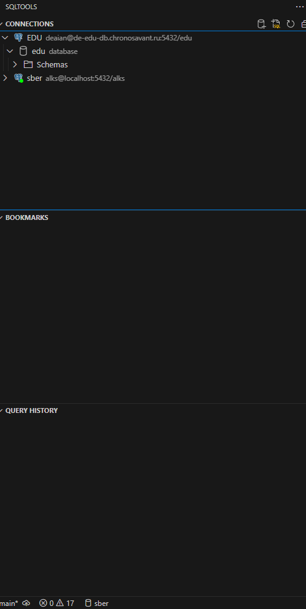

# Домашняя работа №1

## Тема: подключение к образовательной Базе Данных

**Условие**: имеется образовательная База Данных. 

Необходимо произвести подключение к ней, а также продемонстрировать на проверочном подключении, что соединение установлено корректно.

**Возможные решения**: 

- **DBeaver**;
- **Через VSCode (с помощью расширений)**.

### Решение 1 - подключение через DBeaver.

- Для начала необходимо скачать DBeaver (https://dbeaver.io/download/) и установить его (выбрать необходимый установочный файл в зависимости от конфигурации).
- Для подключения к БД необходимо ввести следующие данные:
    - Имя пользователя БД: *confidential*;
    - Пароль: *confidential*;
    - HOST: de-edu-db.chronosavant.ru;
    - Порт: default (5432);
    - DataBase: *edu*.
- После установки всех параметров для подключения к БД убедиться в том, что соединение установлено корректно.
- Для того, чтобы подключиться к БД нажмите на кнопку **Test Connection**
- Результат:

- Сохранить подключение к БД в DBeaver =)

### Решение 2 - подключение через VSCode.

- Для начала необходимо поставить VSCode (https://code.visualstudio.com/) и установить его (выбрать необходимый установочный файл в зависимости от конфигурации).
- После того, как установили VSCode, необходимо определить рабочую область. Для этого нужно:
    - Создать папку в любом месте для ваших будущих проектов (имя можно придумать любое);
    - Далее в VsCode нажать на кнопку *Открыть Папку*;
- После успешного создания в VsCode рабочей области, необходимо установить нужные расширения для подключения к Базе Данных. Можно выбрать следующие расширения для работы с БД через VSCode:
    - **PostgreSQL**, ссылка на [расширение](https://marketplace.visualstudio.com/items?itemName=ckolkman.vscode-postgres);
    - **SQLTools**, ссылка на [расширение](https://marketplace.visualstudio.com/items?itemName=mtxr.sqltools). **WARNING**: необходимо поставить драйвер PostgreSQL. Однако при запуске SQLTools расширение предложит установить нужный драйвер.
- Далее установить нужные параметры подключения к БД:
    - Имя пользователя БД: *confidential*;
    - Пароль: *confidential*;
    - HOST: de-edu-db.chronosavant.ru;
    - Порт: default (5432);
    - DataBase: *edu*.
- После установки всех параметров для подключения к БД убедиться в том, что соединение установлено корректно.
- Для того, чтобы подключиться к БД нажмите на кнопку **Test Connection**
- Результат:

- Посмотреть доступные соединения можно слева, выбрав расширение **SQLTools**:

Готово! Теперь можно работать с БД с помощью VSCode =))